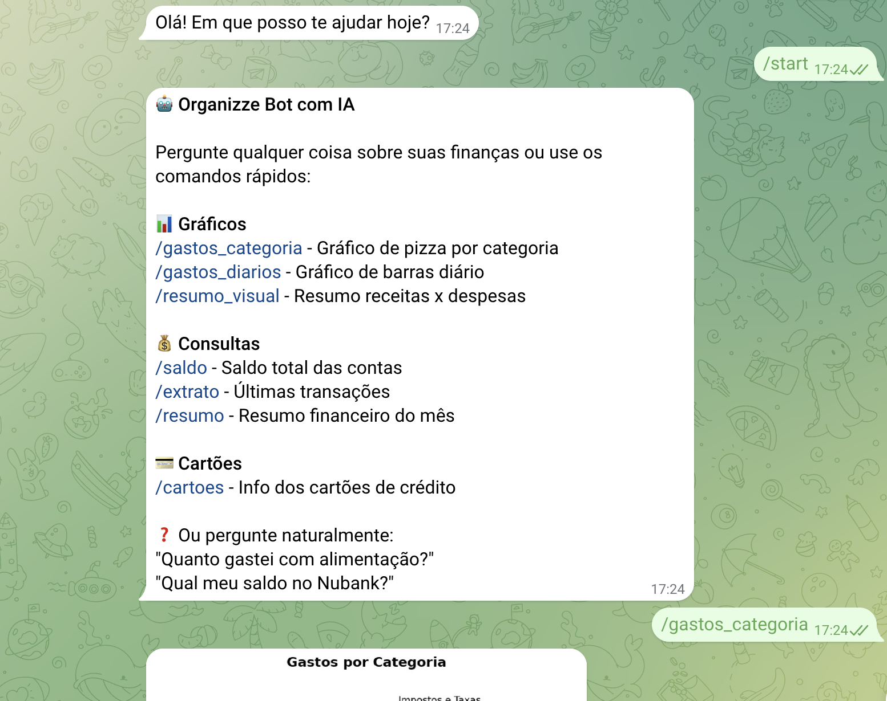

<p align="center">
  
</p>

# Organizze Telegram Bot

A powerful Telegram bot that integrates with [Organizze](https://organizze.com.br) personal finance app, powered by Google Gemini AI. Ask questions about your finances in natural language and get instant responses with charts and insights.

**Version 2.0** - Complete API integration with modular architecture and 31+ endpoints.

## Features

### Core Capabilities

- **Natural Language Queries**: Ask anything about your finances in Portuguese
- **AI-Powered Responses**: Uses Google Gemini 2.0 Flash for intelligent understanding
- **Rich Visualizations**: 6 chart types (pie, bar, summary, budget, invoice, comparison)
- **Quick Commands**: Pre-built shortcuts for common queries
- **Secure**: Whitelist-based access control via Chat ID
- **Budget Tracking**: Monitor spending vs budget goals
- **Invoice Management**: Track credit card invoices and payments
- **Complete Financial Context**: Accounts, transactions, categories, budgets, and more

### Technical Features

- **Modular Architecture**: Clean separation of concerns across 6 modules
- **Complete API Integration**: All 31 Organizze API endpoints implemented
- **Comprehensive Error Handling**: Custom exceptions for auth, validation, and API errors
- **Type Safety**: Pydantic models with automatic validation
- **Full Documentation**: API reference, architecture diagrams, deployment guides
- **Testing Suite**: Automated tests for all endpoints

## Screenshot

<p align="center">
  
</p>

---

## API Coverage

| Category | Endpoints | Status |
|----------|-----------|--------|
| **Users** | 1 endpoint | Complete |
| **Bank Accounts** | 5 endpoints (CRUD) | Complete |
| **Categories** | 5 endpoints (CRUD) | Complete |
| **Credit Cards** | 5 endpoints (CRUD) | Complete |
| **Credit Card Invoices** | 3 endpoints | Complete |
| **Transactions** | 6 endpoints (CRUD + recurring) | Complete |
| **Transfers** | 5 endpoints (CRUD) | Complete |
| **Budgets** | 1 endpoint | Complete |

**Total: 31/31 endpoints (100% coverage)**

---

## Quick Start

<details>
<summary><strong>1. Prerequisites</strong></summary>

- Python 3.11+
- A Telegram Bot (created via [@BotFather](https://t.me/botfather))
- Organizze account with API access
- Google Gemini API key
- A cloud platform account (GCP, AWS, Azure, etc.) or local server

</details>

<details>
<summary><strong>2. Get Your API Keys</strong></summary>

### Telegram Bot Token
1. Open Telegram and message [@BotFather](https://t.me/botfather)
2. Send `/newbot` and follow the prompts
3. Save the bot token provided

### Organizze API Key
1. Log in to [Organizze](https://app.organizze.com.br)
2. Go to **Configurações** → **API**
3. Generate and copy your API key
4. Note your account email

### Google Gemini API Key
1. Go to [Google AI Studio](https://aistudio.google.com/app/apikey)
2. Create a new API key
3. Copy the key

### Your Telegram Chat ID
1. Message your bot or [@userinfobot](https://t.me/userinfobot)
2. The bot will reply with your Chat ID
3. Use this to whitelist yourself

</details>

<details>
<summary><strong>3. Environment Variables</strong></summary>

The application requires the following environment variables:

| Variable | Description | Example |
|----------|-------------|---------|
| `TELEGRAM_TOKEN` | Bot token from BotFather | `123456789:ABCdefGHI...` |
| `ORGANIZZE_EMAIL` | Your Organizze account email | `user@example.com` |
| `ORGANIZZE_API_KEY` | Organizze API key | `abc123def456...` |
| `GEMINI_API_KEY` | Google Gemini API key | `AIzaSy...` |
| `ALLOWED_CHAT_IDS` | Comma-separated list of authorized Telegram Chat IDs | `123456789,987654321` |

### Local Development (.env file)

```bash
# .env
TELEGRAM_TOKEN=your_telegram_bot_token
ORGANIZZE_EMAIL=your_organizze_email
ORGANIZZE_API_KEY=your_organizze_api_key
GEMINI_API_KEY=your_gemini_api_key
ALLOWED_CHAT_IDS=your_chat_id
```

</details>

<details>
<summary><strong>4. Easy Deploy (Recommended for Beginners)</strong></summary>

The easiest way to deploy this bot is using **Railway** or **Render** - no technical knowledge required!

### Option A: Deploy on Railway (Recommended)

1. **Create a Railway account**
   - Go to [railway.app](https://railway.app)
   - Sign up with your GitHub account

2. **Deploy from GitHub**
   - Click "New Project" -> "Deploy from GitHub repo"
   - Select this repository
   - Railway will automatically detect the Dockerfile

3. **Add your environment variables**
   - Go to your project -> "Variables" tab
   - Click "New Variable" and add each one:
     ```
     TELEGRAM_TOKEN = your_bot_token_here
     ORGANIZZE_EMAIL = your_email_here
     ORGANIZZE_API_KEY = your_api_key_here
     GEMINI_API_KEY = your_gemini_key_here
     ALLOWED_CHAT_IDS = your_chat_id_here
     ```

4. **Get your bot URL**
   - Go to "Settings" -> "Networking" -> "Generate Domain"
   - Copy the URL (looks like: `https://your-app.up.railway.app`)

5. **Connect Telegram to your bot**
   - Open this link in your browser (replace the values):
     ```
     https://api.telegram.org/bot<YOUR_TELEGRAM_TOKEN>/setWebhook?url=<YOUR_RAILWAY_URL>
     ```
   - You should see: `{"ok":true,"result":true,"description":"Webhook was set"}`

6. **Done!** Message your bot on Telegram to test it.

### Option B: Deploy on Render

1. **Create a Render account**
   - Go to [render.com](https://render.com)
   - Sign up with your GitHub account

2. **Create a new Web Service**
   - Click "New" -> "Web Service"
   - Connect your GitHub and select this repository
   - Choose "Docker" as the environment

3. **Configure the service**
   - Name: `organizze-bot`
   - Region: Choose closest to you
   - Plan: Free (or Starter for better performance)

4. **Add environment variables**
   - Scroll to "Environment Variables"
   - Add the same 5 variables as listed above

5. **Deploy and get URL**
   - Click "Create Web Service"
   - Wait for deployment (2-5 minutes)
   - Copy your URL from the dashboard

6. **Set Telegram webhook** (same as Railway step 5)

### Troubleshooting

- **Bot not responding?** Check if your Chat ID is correct in `ALLOWED_CHAT_IDS`
- **Error 401?** Your Organizze API key might be wrong
- **Webhook error?** Make sure the URL ends without a trailing slash

</details>

---

## CI/CD Pipeline

This project includes **automated deployment** via GitHub Actions. Every push to `main` triggers automatic deployment to Google Cloud Run.

### Setup CI/CD (One-time)

<details>
<summary><strong>Configure Automated Deployments</strong></summary>

1. **Create GCP secrets** (if not already done):
```bash
gcloud config set project YOUR_PROJECT_ID

# Create secrets in Secret Manager
echo -n "your_telegram_token" | gcloud secrets create TELEGRAM_TOKEN --data-file=-
echo -n "your_email" | gcloud secrets create ORGANIZZE_EMAIL --data-file=-
echo -n "your_api_key" | gcloud secrets create ORGANIZZE_API_KEY --data-file=-
echo -n "your_gemini_key" | gcloud secrets create GEMINI_API_KEY --data-file=-
echo -n "your_chat_id" | gcloud secrets create ALLOWED_CHAT_IDS --data-file=-
```

2. **Grant Secret Manager access:**
```bash
PROJECT_NUMBER=$(gcloud projects describe YOUR_PROJECT_ID --format='value(projectNumber)')

gcloud projects add-iam-policy-binding YOUR_PROJECT_ID \
  --member="serviceAccount:${PROJECT_NUMBER}-compute@developer.gserviceaccount.com" \
  --role="roles/secretmanager.secretAccessor"
```

3. **Create service account key for GitHub Actions:**
```bash
# Create service account key
gcloud iam service-accounts keys create ~/gcp-sa-key.json \
  --iam-account=${PROJECT_NUMBER}-compute@developer.gserviceaccount.com

# Display the key (copy this)
cat ~/gcp-sa-key.json
```

4. **Add secret to GitHub repository:**
   - Go to: `https://github.com/YOUR_USERNAME/telegram-bot-organizze/settings/secrets/actions`
   - Click **New repository secret**
   - Name: `GCP_SA_KEY`
   - Value: Paste the entire JSON content from step 3
   - Click **Add secret**

5. **Done!** Now every `git push` to `main` automatically deploys to Cloud Run.

### How It Works

```yaml
# .github/workflows/deploy.yml
on:
  push:
    branches: [main]  # Triggers on push to main
  workflow_dispatch:   # Manual trigger option

jobs:
  deploy:
    - Authenticate with GCP using GCP_SA_KEY
    - Build Docker container from source
    - Deploy to Cloud Run with secrets
    - Show deployment URL
```

### Manual Deployment Trigger

You can also trigger deployment manually:
1. Go to: `https://github.com/YOUR_USERNAME/telegram-bot-organizze/actions`
2. Select **Deploy to Cloud Run** workflow
3. Click **Run workflow** → **Run workflow**

### View Deployment Status

Check deployment progress:
- GitHub: `https://github.com/YOUR_USERNAME/telegram-bot-organizze/actions`
- GCP Console: Cloud Run → organizze-bot → Revisions

</details>

---

## Manual Deployment (Advanced)

<details>
<summary><strong>Google Cloud Run</strong></summary>

### One-time Manual Deploy

1. **Create secrets** (same as CI/CD setup above)

2. **Deploy manually:**
```bash
gcloud run deploy organizze-bot \
  --source . \
  --region YOUR_REGION \
  --platform managed \
  --allow-unauthenticated \
  --set-secrets="TELEGRAM_TOKEN=TELEGRAM_TOKEN:latest,ORGANIZZE_EMAIL=ORGANIZZE_EMAIL:latest,ORGANIZZE_API_KEY=ORGANIZZE_API_KEY:latest,GEMINI_API_KEY=GEMINI_API_KEY:latest,ALLOWED_CHAT_IDS=ALLOWED_CHAT_IDS:latest"
```

3. **Set Telegram webhook:**
```bash
curl "https://api.telegram.org/bot<YOUR_TOKEN>/setWebhook?url=<YOUR_CLOUD_RUN_URL>&drop_pending_updates=true"
```

</details>

<details>
<summary><strong>AWS (Lambda + API Gateway)</strong></summary>

1. **Create a Lambda function** with Python 3.11 runtime

2. **Package dependencies:**
```bash
pip install -r requirements.txt -t package/
cp *.py package/
cd package && zip -r ../function.zip .
```

3. **Upload** `function.zip` to Lambda

4. **Set environment variables** in Lambda configuration

5. **Create API Gateway** trigger (HTTP API)

6. **Set Telegram webhook** to your API Gateway URL

</details>

<details>
<summary><strong>Docker (Self-hosted)</strong></summary>

1. **Build the image:**
```bash
docker build -t organizze-bot .
```

2. **Run with environment variables:**
```bash
docker run -d \
  -p 8080:8080 \
  -e TELEGRAM_TOKEN=your_token \
  -e ORGANIZZE_EMAIL=your_email \
  -e ORGANIZZE_API_KEY=your_api_key \
  -e GEMINI_API_KEY=your_gemini_key \
  -e ALLOWED_CHAT_IDS=your_chat_id \
  --name organizze-bot \
  organizze-bot
```

3. **Set up reverse proxy** (nginx/caddy) with HTTPS

4. **Set Telegram webhook** to your server URL

</details>

---

## Usage

### Available Commands

| Command | Description | Status |
|---------|-------------|--------|
| `/start`, `/help` | Show help menu with all commands | Active |
| `/gastos_categoria` | Pie chart of expenses by category | Active |
| `/gastos_diarios` | Bar chart of daily expenses | Active |
| `/resumo_visual` | Summary chart (income vs expenses vs balance) | Active |
| `/saldo` | Total balance across all accounts | Active |
| `/extrato` | Recent transactions | Active |
| `/resumo` | Monthly financial summary | Active |
| `/cartoes` | Credit cards information | Active |
| `/orcamento` | Budget progress by category | Coming Soon |
| `/fatura` | Current credit card invoice | Coming Soon |
| `/faturas` | Invoice history chart | Coming Soon |

### Natural Language Examples

Ask anything in Portuguese:

- "Qual meu saldo total?"
- "Quanto gastei esse mês?"
- "Quanto gastei com alimentação?"
- "Quais foram minhas últimas transações?"
- "Mostra um gráfico dos meus gastos"
- "Quanto tenho na conta Nubank?"
- "Como está meu orçamento?"
- "Qual o saldo do cartão?"

---

## Project Structure

```
telegram-bot-organizze/
│
├── Core Application
│   ├── main.py                      # Flask app & webhook handler
│   ├── organizze_client.py          # Complete API client (31 endpoints)
│   ├── ai_assistant.py              # Gemini AI integration
│   ├── telegram_bot.py              # Telegram utilities & auth
│   ├── charts.py                    # Chart generation (6 types)
│   └── models.py                    # Pydantic data models
│
├── Testing & Validation
│   └── test_api.py                  # API testing suite
│
├── Documentation
│   ├── README.md                    # This file
│   ├── API_DOCUMENTATION.md         # Complete API reference (1000+ lines)
│   ├── ARCHITECTURE.md              # System design & diagrams
│   ├── IMPLEMENTATION_SUMMARY.md    # Implementation details
│   └── DEPLOYMENT_CHECKLIST.md      # Deployment guide
│
├── Configuration
│   ├── requirements.txt             # Python dependencies
│   ├── Dockerfile                   # Container definition
│   ├── .gitignore                   # Git ignore rules
│   └── .github/workflows/
│       └── deploy.yml               # CI/CD pipeline (GitHub Actions)
│
└── Assets
    ├── hero.png                     # README hero image
    └── bot-screenshot.png           # Bot interface screenshot
```

**Total: 3,568 lines of code** across 12 files (6 modules + 4 docs + 1 test suite + 1 CI/CD workflow)

---

## Architecture

### High-Level Overview

```
┌─────────────────────────────────────────────────────────────┐
│                        Telegram User                         │
└───────────────────────┬─────────────────────────────────────┘
                        │ HTTPS Webhook
                        ▼
┌─────────────────────────────────────────────────────────────┐
│                   Cloud Run / Railway / Render               │
│  ┌───────────────────────────────────────────────────────┐  │
│  │               main.py (Flask Router)                  │  │
│  └────┬──────────────────┬──────────────────┬────────────┘  │
│       │                  │                  │                │
│       ▼                  ▼                  ▼                │
│  ┌─────────┐      ┌──────────┐      ┌─────────────┐        │
│  │Telegram │      │   AI     │      │  Organizze  │        │
│  │  Bot    │      │Assistant │      │   Client    │        │
│  └────┬────┘      └────┬─────┘      └──────┬──────┘        │
│       │                │                    │                │
│       │                ▼                    ▼                │
│       │         ┌──────────┐        ┌─────────────┐        │
│       │         │  Gemini  │        │ Organizze   │        │
│       │         │2.0 Flash │        │  API v2     │        │
│       │         └──────────┘        └─────────────┘        │
│       │                                                      │
│       │              Charts                                 │
│       │           ┌─────────┐                               │
│       └───────────┤charts.py├───────────────────────────────┘
│                   └─────────┘                               │
└─────────────────────────────────────────────────────────────┘
```

### Module Dependencies

- **main.py** → orchestrates all modules
- **organizze_client.py** → handles all API requests
- **ai_assistant.py** → processes natural language with Gemini
- **telegram_bot.py** → manages Telegram communication
- **charts.py** → generates matplotlib visualizations
- **models.py** → validates data structures with Pydantic

For detailed architecture information, see [ARCHITECTURE.md](ARCHITECTURE.md).

---

## Documentation

| Document | Description | Lines |
|----------|-------------|-------|
| [API_DOCUMENTATION.md](API_DOCUMENTATION.md) | Complete API reference with examples | 1000+ |
| [ARCHITECTURE.md](ARCHITECTURE.md) | System design, diagrams, scalability | 500+ |
| [IMPLEMENTATION_SUMMARY.md](IMPLEMENTATION_SUMMARY.md) | What was built and why | 800+ |
| [DEPLOYMENT_CHECKLIST.md](DEPLOYMENT_CHECKLIST.md) | Step-by-step deployment guide | 400+ |

---

## Security Considerations

<details>
<summary><strong>Security Layers</strong></summary>

1. **Secret Management**: Use GCP Secret Manager, AWS Secrets Manager, or environment variables
2. **Access Control**: Chat ID whitelist prevents unauthorized access
3. **HTTPS Only**: All communication encrypted in transit
4. **Error Sanitization**: No sensitive data in logs or error messages
5. **Type Validation**: Pydantic validates all data structures
6. **Rate Limiting**: Protected against API abuse

### Best Practices

- Never commit secrets to version control
- Use secret managers for production
- Whitelist Chat IDs to restrict access
- Enable HTTPS for webhook endpoints
- Rotate API keys periodically
- Monitor logs for unauthorized access

</details>

---

## Testing

Run the comprehensive test suite:

```bash
# Install dependencies
pip install -r requirements.txt

# Set environment variables
export ORGANIZZE_EMAIL="your-email"
export ORGANIZZE_API_KEY="your-api-key"

# Run tests
python test_api.py
```

The test suite validates:
- All 31 API endpoints
- Error handling (401, 422, timeouts)
- Data conversion (cents ↔ reais)
- Response parsing
- Chart generation

---

## Troubleshooting

<details>
<summary><strong>Bot not responding</strong></summary>

1. Check webhook is set correctly:
```bash
curl "https://api.telegram.org/bot<TOKEN>/getWebhookInfo"
```

2. Verify your Chat ID is in `ALLOWED_CHAT_IDS`

3. Check application logs for errors

4. Reset webhook:
```bash
curl "https://api.telegram.org/bot<TOKEN>/deleteWebhook?drop_pending_updates=true"
curl "https://api.telegram.org/bot<TOKEN>/setWebhook?url=<YOUR_URL>"
```

</details>

<details>
<summary><strong>API Authentication Errors (401)</strong></summary>

1. Verify `ORGANIZZE_EMAIL` is correct
2. Regenerate API key at [Organizze Settings](https://app.organizze.com.br/configuracoes/api-keys)
3. Update `ORGANIZZE_API_KEY` environment variable
4. Redeploy the application

</details>

<details>
<summary><strong>Charts not generating</strong></summary>

1. Ensure there are transactions in the current month
2. Check if categories are properly configured
3. Verify matplotlib is installed
4. Check logs for specific chart generation errors

</details>

<details>
<summary><strong>Import errors after deployment</strong></summary>

1. Ensure all modules are in the same directory
2. Check `requirements.txt` includes all dependencies:
   - `flask==3.0.0`
   - `requests==2.31.0`
   - `gunicorn==21.2.0`
   - `google-generativeai==0.8.0`
   - `matplotlib==3.8.2`
   - `pydantic==2.5.3`
3. Rebuild and redeploy

</details>

---

## Roadmap

### Completed (Version 2.0)

- [x] Complete API integration (31 endpoints)
- [x] Modular architecture
- [x] Type-safe data models
- [x] Comprehensive error handling
- [x] Budget endpoint integration
- [x] Invoice endpoint integration
- [x] Full documentation suite
- [x] Testing framework

### Phase 3 (Coming Soon)

- [ ] Budget tracking commands (`/orcamento`, `/metas`)
- [ ] Invoice management commands (`/fatura`, `/faturas`)
- [ ] Transaction creation via chat (`/gasto`, `/receita`)
- [ ] Transfer operations (`/transferir`)
- [ ] Advanced date queries (`/gastos_semana`, `/comparar_meses`)
- [ ] Spending alerts and notifications
- [ ] Category management via chat

### Future Enhancements

- [ ] Redis caching layer for performance
- [ ] Predictive analytics with AI
- [ ] Multi-user family accounts
- [ ] Custom report generation
- [ ] Scheduled financial summaries
- [ ] Budget alerts via notifications

---

## Contributing

Contributions are welcome! Here's how:

1. Fork the repository
2. Create a feature branch (`git checkout -b feature/amazing-feature`)
3. Make your changes
4. Run tests (`python test_api.py`)
5. Commit your changes (`git commit -m 'Add amazing feature'`)
6. Push to the branch (`git push origin feature/amazing-feature`)
7. Open a Pull Request

### Development Setup

```bash
# Clone repository
git clone https://github.com/yourusername/telegram-bot-organizze.git
cd telegram-bot-organizze

# Install dependencies
pip install -r requirements.txt

# Set environment variables
cp .env.example .env
# Edit .env with your credentials

# Run locally
python main.py

# Run tests
python test_api.py
```

---

## Project Stats

| Metric | Value |
|--------|-------|
| **API Coverage** | 100% (31/31 endpoints) |
| **Lines of Code** | 3,568 |
| **Modules** | 6 |
| **Documentation** | 4 comprehensive guides |
| **Chart Types** | 6 |
| **Test Cases** | Complete suite |
| **CI/CD** | GitHub Actions (automated deployment) |
| **Python Version** | 3.11+ |
| **Cloud Platforms** | GCP, AWS, Azure, Railway, Render |

---

## License

This project is open source and available under the [MIT License](LICENSE).

---

## Acknowledgments

- [Organizze](https://organizze.com.br) for the personal finance API
- [Google Gemini](https://deepmind.google/technologies/gemini/) for AI capabilities
- [Flask](https://flask.palletsprojects.com/) for the web framework
- [Pydantic](https://docs.pydantic.dev/) for data validation
- [Matplotlib](https://matplotlib.org/) for chart generation

---

## Support

- [Complete API Documentation](API_DOCUMENTATION.md)
- [Architecture Guide](ARCHITECTURE.md)
- [Deployment Guide](DEPLOYMENT_CHECKLIST.md)
- [Issues](https://github.com/yourusername/telegram-bot-organizze/issues)

---

<p align="center">
  <strong>Version 2.0</strong> - Complete API Integration
</p>
